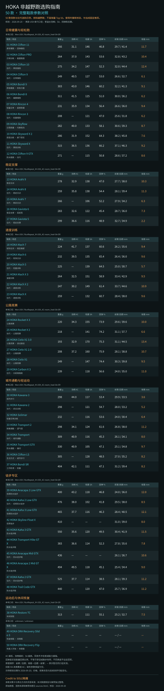
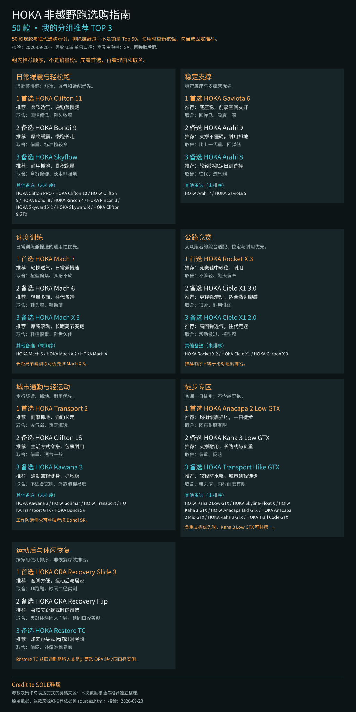

# Shoe Comparison — 两张图完成鞋款选购

**Credit to SOLE鞋履**

参数决策卡与表达方式的灵感来源；本项目的数据核验、选购判断与实现独立整理。实测数据另署实际来源，不表示 SOLE鞋履参与本次排名或提供背书。

这个独立 skill 支持任意品牌和数量，默认产出：

1. **完整鞋款对比图**：按用途分组，保留全部鞋款与统一口径的重量、泡棉 AC、后跟吸震 SA、回弹、前后厚度与坡差。
2. **每组 Top 3 推荐图**：标记首选，给出理由与取舍，其他型号保留为未排序备选。

不是固定 HOKA 清单，不是固定 50 款，也不凭空声称销量 Top 50。每次执行先检索和核验，再排序。

## 使用 skill

入口：[skills/shoe-comparison/SKILL.md](../skills/shoe-comparison/SKILL.md)。

把整个 `skills/shoe-comparison` 文件夹安装到你自己的 skill 目录，或让支持 GitHub skill 安装的助手从本仓库此路径安装。已有同名 skill 时先比较再替换；本次新增是独立 skill，未改变仓库原有插件的默认安装组合。

使用示例：

> 使用 $shoe-comparison，比较我给出的这些鞋款，输出完整参数图和分组 Top 3 推荐图，保留推荐理由、取舍以及 Credit to SOLE鞋履。

> 使用 $shoe-comparison，比较 HOKA 50 款非越野跑鞋。现款不足可明确标注往代，无法核验销量时使用选购清单标题。

> 使用 $shoe-comparison，比较这两双不同品牌的鞋，缺失数据留空；只列实际可推荐的数量。

## 可复现制图

需要 Node.js 18+，无需 npm 依赖。先按 [数据约定](../skills/shoe-comparison/references/data-and-schema.md)完成来源核验并填好 JSON，再运行：

```bash
node skills/shoe-comparison/scripts/build_shoe_guide.cjs examples/shoe-comparison/hoka-50/guide.json output/shoe-guide
node skills/shoe-comparison/scripts/test_shoe_guide.cjs examples/shoe-comparison/hoka-50/guide.json
```

输出 `comparison.svg`、`top3.svg`、`sources.html` 与 `top3.prompt.txt`。SVG 是可缩放图片，中文显示需要系统中文字体。需要 PNG 时从 SVG 渲染导出并检查字体与裁切；精确实验数值不用生成式工具重绘。

有图片生成工具时，以 `top3.prompt.txt` 生成更丰富的推荐海报；生成后逐个核验鞋名、分组、前三顺序、理由、取舍与 credit。该海报替代代码版推荐主图，默认仍为两项主图交付。

## HOKA 50 款示例

[数据](../examples/shoe-comparison/hoka-50/guide.json) · [来源与推荐依据](../examples/shoe-comparison/hoka-50/sources.html) · [推荐海报提示词](../examples/shoe-comparison/hoka-50/top3.prompt.txt)

本示例核验日为 **2026-09-20**，包含现款、往代、徒步与恢复款，排除越野跑。它不是实时销量榜，使用时需要更新来源、在售状态及用户条件。推荐是基于当时资料的选购判断。

### 完整参数图



### 各组 Top 3 图



## 验证边界

已在 JavaScript V8 执行环境运行渲染核心与 127 项断言，覆盖完整 50 款、两图署名、跨品牌、混合样本、缺失值、重复和越组引用、无关证据、坡差冲突、未定义数值、输出转义与确定性。

发布时本地执行环境断开，因此尚未执行 Node 文件系统入口、SVG 浏览器视觉复核及 PNG 导出。不能把结构检查当作完整视觉验收。此限制不影响读取 skill 与运行上述本地命令。
